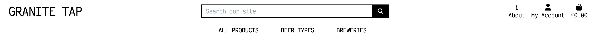
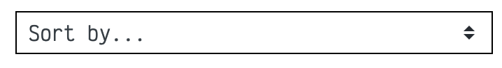

#  Granite Tap

Granite Tap is a B2C e-commerce store selling locally sourced beer from breweries from Aberdeen and Aberdeenshire, Scotland.

Granite Tap is your go-to online platform for discovering and enjoying an exquisite selection of locally brewed beers from the vibrant and thriving beer scene in Aberdeen and Aberdeenshire, Scotland. We take pride in connecting beer enthusiasts with the finest creations of local breweries, offering a unique taste of the region's craft beer culture.

The site is aimed at users who are looking to expand on their beer tastes. Rather than buying the same old, run of the mill beer from the supermarkets, users can experience a whole new world of beer and see what the North East of Scotland has to offer. 

Users can view different types beers from different breweries, get information on each product and make purchases through an esy to use, payment system.

The payment system uses Stripe. 

***As this site is for educational purposes, please do not use real debit/credit card details whilst using the site.***

Take a look though the live project - [Granite Tap](https://granite-tap-d7fc252cb5b2.herokuapp.com/)

---

CONTENTS

---

## Features

### Header

- The header is present on every page of the site giving users full navigation at all times.

#### Logo

- The logo for the site is a simple text logo generated within the html using the Victor Mono google font.
- The logo  links to the home page and is situated in the top left corner of the header.

#### Search Bar

- The search bar is displayed at the top of the page, always accessible to the user.
- The when a user inputs a pice of text, the results will return any product in which the product title or description holds.

#### About Icon

- The About icon links to the About Us page where the user can find information on Granite Tap, FAQs, newsletter sign up and a contact form.

#### My Account Icon

##### Unauthenticated Users

- The My Account icon, when clicked, will reveal a dropdown menu consisting of two options.
  - Register
  - Login

##### Authenticated Users

- If the user is authenticated, "My Account" text will be replaced by the users username they chose when registering for the site.
- This gives the user a visual indication that they are logged in to their account.
- When clicked, a dropdown menu is revealed to the user, consisting of links to My Profile, Wishlist and Logout.

#### Shopping Bag Icon

- The Shopping Bag icon links the users to the shopping bag page where users can view what products, if any are in there ready to be purchased.
- Beneath the Shopping Bag icon displays the total cost of their shopping bag and can be seen at all times so users can keep track of how much they are spending.

---

### Main Navigation

- The Main Navigation bar consists of three dropdown menus for the users to access the products list.

#### All Products

- The All Products dropdown menu displays four options for the user to filter the site products by:
    - By Price
    - By Rating
    - By Category
    - All Products

##### By Price

- The By Price option returns to the user the full product list in ascending order of price (lowest to highest).

##### By Rating

- The By Rating option will return to the user the full product list in descending order (highest to lowest).

##### By Category

- The By Category option will return to the user the full product list of beer type in alphabetical order.

##### All Products

- The All Products option will return to the user the full product list.

#### Beer Types

- The Beer Types dropdown menu displays four options for the user to filter the products by their beer type:
    - Lager
    - Ale
    - Stout
    - Sour

##### Lager

- The Lager option will return to the user all the different type of Lager in the product list.

##### Ale

- The Ale option will return to the user all the different type of Ale in the product list.

##### Stout

- The Stout option will return to the user all the different type of Stout in the product list.

##### Sour

- The Sour option will return to the user all the different type of Sour in the product list.

#### Breweries

- The Breweries dropdown menu displays four options for the user to filter the products by their brewery:
    - Brewdog
    - Brew Toon
    - Fierce
    - Six° North

##### Brewdog

- The Brewdog option will return to the user all the different beer produced by Brewdog in the product list.

##### Brew Toon

- The Brew Toon option will return to the user all the different beer produced by Brew Toon in the product list.

##### Fierce

- The Fierce option will return to the user all the different beer produced by Fierce in the product list.

##### Six° North

- The Six° North option will return to the user all the different beer produced by Six° North in the product list.

---
### Delivery Banner

- The delivery banner is located beneath the main navigation.
- The delivery banner indicates to users that if they spend more than £30 on their order, the delivery is free.

---

### Footer

- The footer is displayed on all pages of the site.
- The footer contains links to various features on the site.

#### Contact Us

- The Contact Us link will direct the user to the contact for on the About Page

#### Subscribe to our Newsletter

- The Subscibe to our Newsletter link will direct the user to the newsletter sign up on the about page

#### Visit us on Facebook

- The Visit us on Facebook link will direct the user to Facebook Login page on a new tab.
- As the Granite Tap site is for educational purposes, the Granite Tap Facebook buisness page has been deactivated.
- To view screenshots of the Granite Tap Facebook business page, please see the [Granite Tap Web Marketing](#Granite-Tap-Web-Marketing) section.

#### Privacy Policy

- The Privacy Policy link will direct users to the [Granite Tap Privacy Policy](https://www.termsfeed.com/live/6ce57fb3-3e55-4587-9ed0-703fd41df7f0) on a new tab.

---

### Home Page

- The background image of the home page is a of a hand holding a glass whilst pouring a beer from a bar tap.
- When entering the site, the user will be greeted with a simple message indicating that they are about to begin an exploration of the beer from the Northeast of Scotland.
- Beneath the welcome message, is a "Shop Now" button alllowing users to jump straight into exploring the products list.

---

### Products Page

- Users can access the products page from the main nav as documented above.

- When a users enters the product page, displayed will be the beer products they have filtered.

#### Product Count

- The product page displays a product count of how many products come under any specific filter. This giove the user an indication of ow many products of that type there are.

#### Product Page Filtering

- Much like the All Products dropdown menu in the Main Navigation, users can also use the "Sort by..." dropdown menu to filter the results as they see fit.

- Users can filter the products page using various options.

##### Filtering options

- Price (Low to High)
- Price (High to Low)
- Rating (Low to High)
- Rating (High to Low)
- Name (A-Z)
- Name (Z-A)
- Category (A-Z)
- Category (Z-A)

#### Product Page Details

- Users will be able to see various details around each product.

- Each product has specific information attached:
    - Product Image
        - The product image is a link to the product details page
    - Product Price
    - Product ABV percentage
    - The Brewery that manufactures the product.
        - This is a link to the brewery product list
    - The Beer Type
        - This is a link to the beer type product list
    - Product Rating

---

### Product Detail Page

- When a user clicks on a product form the product page they are directed to the Product Detail page.

#### Product Specific Details

- Within the product detail page, users can find product specific details:
    - Product Image
    - Product Name
    - Product Price
    - Brewery
    - Beer Type
    - Product Rating
    - Product Description
    - Volume of Conatiner
    - ABV percentage

#### Wishlist Button

- Users can add products to a wishlist and come back to purchasing them at a later date.

#### Quantity

- Users can adjust the quantity of the product they want to add to their shopping bag.
- This can be done by using either manually typing in the quantity or using the +/- buttons on either side of the input.

#### Adding Products to the Shopping Bag

- When users have decided they want to add the product to their shopping bag, they can clcik the "Add to Bag" button.

##### Add to Bag Success Message

- Once a product has been added to the shoppping bag, a success message is displayed.
- This message contains: 
    - A message confirming which product has been added.
    - The bag content which is scrollable.
    - The bag total.
    - A message informing the user how much more they need to spend if they want to take advantage of free delivery.
    - A button directing the user to the shopping bag.

#### Keeping Shopping Button

- Within the Products Detail page, there is also a "Keep Shopping" button. 
- If the user want to continue shopping, they acn click the "Keep shoppping" button and be redirected back to the products page.

#### You May Also Like...

- Beneath the product details section, a related products section has been implemented.
- This gives users the chance to view products of the same beer type and explore other breweries.
- The selection has has been randomised so everytime a user views a product, the related products will display random products of the same beer type.

