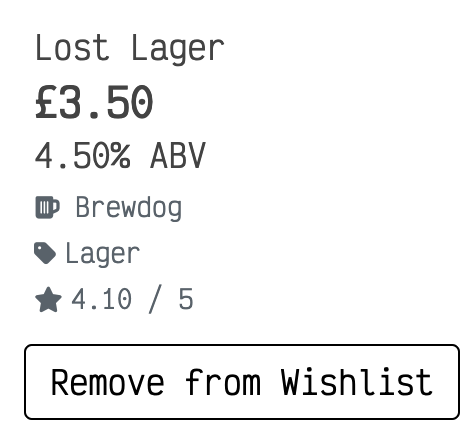
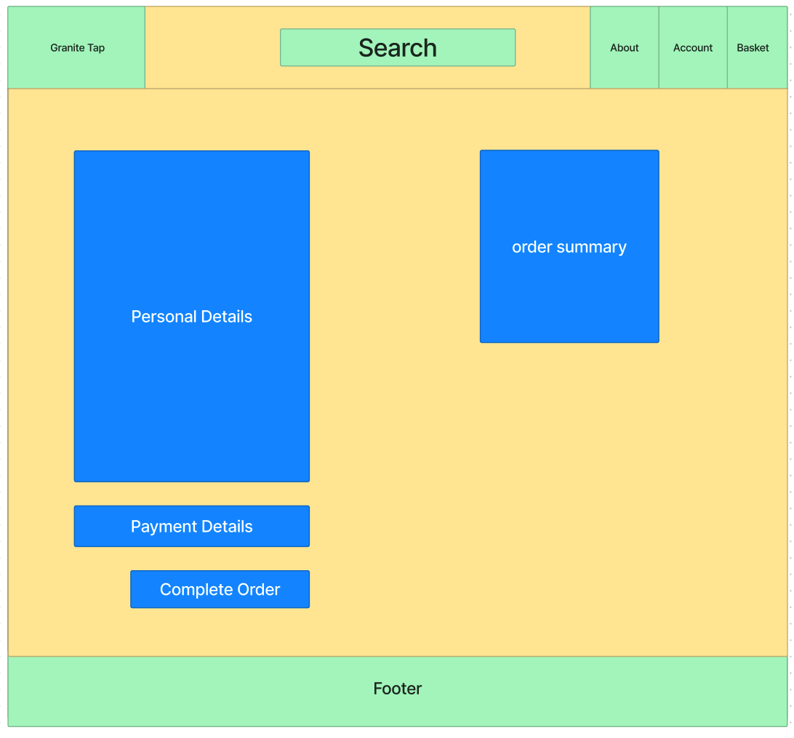
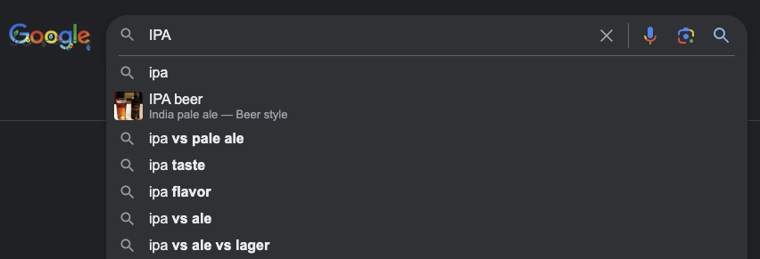
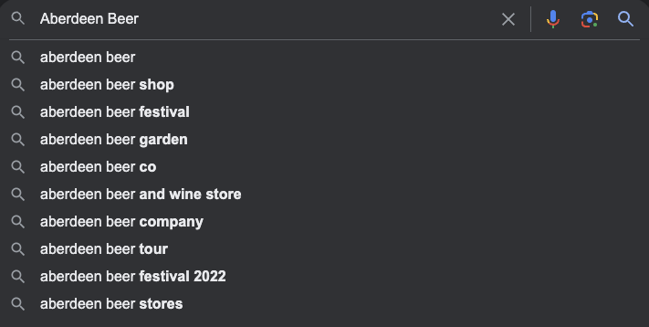

#  Granite Tap

Granite Tap is a B2C e-commerce store selling locally sourced beer from breweries from Aberdeen and Aberdeenshire, Scotland.

Granite Tap is your go-to online platform for discovering and enjoying an exquisite selection of locally brewed beers from the vibrant and thriving beer scene in Aberdeen and Aberdeenshire, Scotland. We take pride in connecting beer enthusiasts with the finest creations of local breweries, offering a unique taste of the region's craft beer culture.

The site is aimed at users who are looking to expand on their beer tastes. Rather than buying the same old, run of the mill beer from the supermarkets, users can experience a whole new world of beer and see what the North East of Scotland has to offer. 

Users can view different types beers from different breweries, get information on each product and make purchases through an esy to use, payment system.

The payment system uses Stripe. 

***As this site is for educational purposes, please do not use real debit/credit card details whilst using the site.***

Take a look though the live project - [Granite Tap](https://granite-tap-d7fc252cb5b2.herokuapp.com/)


---

CONTENTS

---

## Features

### Header


- The header is present on every page of the site giving users full navigation at all times.

#### Logo


- The logo for the site is a simple text logo generated within the html using the Victor Mono google font.
- The logo  links to the home page and is situated in the top left corner of the header.

#### Search Bar


- The search bar is displayed at the top of the page, always accessible to the user.
- The when a user inputs a pice of text, the results will return any product in which the product title or description holds.

#### About Icon


- The About icon links to the About Us page where the user can find information on Granite Tap, FAQs, newsletter sign up and a contact form.

#### My Account Icon

##### Unauthenticated Users


- The My Account icon, when clicked, will reveal a dropdown menu consisting of two options.
  - Register
  - Login


##### Authenticated Users


- If the user is authenticated, "My Account" text will be replaced by the users username they chose when registering for the site.
- This gives the user a visual indication that they are logged in to their account.
- When clicked, a dropdown menu is revealed to the user, consisting of links to My Profile, Wishlist and Logout.


#### Shopping Bag Icon


- The Shopping Bag icon links the users to the shopping bag page where users can view what products, if any are in there ready to be purchased.
- Beneath the Shopping Bag icon displays the total cost of their shopping bag and can be seen at all times so users can keep track of how much they are spending.

---

### Main Navigation


- The Main Navigation bar consists of three dropdown menus for the users to access the products list.

#### All Products


- The All Products dropdown menu displays four options for the user to filter the site products by:
    - By Price
    - By Rating
    - By Category
    - All Products

##### By Price

- The By Price option returns to the user the full product list in ascending order of price (lowest to highest).

##### By Rating

- The By Rating option will return to the user the full product list in descending order (highest to lowest).

##### By Category

- The By Category option will return to the user the full product list of beer type in alphabetical order.

##### All Products

- The All Products option will return to the user the full product list.


#### Beer Types


- The Beer Types dropdown menu displays four options for the user to filter the products by their beer type:
    - Lager
    - Ale
    - Stout
    - Sour

##### Lager

- The Lager option will return to the user all the different type of Lager in the product list.

##### Ale

- The Ale option will return to the user all the different type of Ale in the product list.

##### Stout

- The Stout option will return to the user all the different type of Stout in the product list.

##### Sour

- The Sour option will return to the user all the different type of Sour in the product list.

#### Breweries


- The Breweries dropdown menu displays four options for the user to filter the products by their brewery:
    - Brewdog
    - Brew Toon
    - Fierce
    - Six° North


##### Brewdog

- The Brewdog option will return to the user all the different beer produced by Brewdog in the product list.

##### Brew Toon

- The Brew Toon option will return to the user all the different beer produced by Brew Toon in the product list.

##### Fierce

- The Fierce option will return to the user all the different beer produced by Fierce in the product list.

##### Six° North

- The Six° North option will return to the user all the different beer produced by Six° North in the product list.

---
### Delivery Banner


- The delivery banner is located beneath the main navigation.
- The delivery banner indicates to users that if they spend more than £30 on their order, the delivery is free.

---

### Footer


- The footer is displayed on all pages of the site.
- The footer contains links to various features on the site.

#### Contact Us

- The Contact Us link will direct the user to the contact for on the About Page

#### Subscribe to our Newsletter

- The Subscibe to our Newsletter link will direct the user to the newsletter sign up on the about page

#### Visit us on Facebook

- The Visit us on Facebook link will direct the user to Facebook Login page on a new tab.
- As the Granite Tap site is for educational purposes, the Granite Tap Facebook buisness page has been deactivated.
- To view screenshots of the Granite Tap Facebook business page, please see the [Granite Tap Web Marketing](#Granite-Tap-Web-Marketing) section.

#### Privacy Policy

- The Privacy Policy link will direct users to the [Granite Tap Privacy Policy](https://www.termsfeed.com/live/6ce57fb3-3e55-4587-9ed0-703fd41df7f0) on a new tab.

---

### Home Page


- The background image of the home page is a of a hand holding a glass whilst pouring a beer from a bar tap.
- When entering the site, the user will be greeted with a simple message indicating that they are about to begin an exploration of the beer from the Northeast of Scotland.
- Beneath the welcome message, is a "Shop Now" button alllowing users to jump straight into exploring the products list.

---

### Products Page

- Users can access the products page from the main nav as documented above.


- When a users enters the product page, displayed will be the beer products they have filtered.

#### Product Count


- The product page displays a product count of how many products come under any specific filter. This giove the user an indication of ow many products of that type there are.

#### Product Page Filtering


- Much like the All Products dropdown menu in the Main Navigation, users can also use the "Sort by..." dropdown menu to filter the results as they see fit.


- Users can filter the products page using various options.

##### Filtering options

- Price (Low to High)
- Price (High to Low)
- Rating (Low to High)
- Rating (High to Low)
- Name (A-Z)
- Name (Z-A)
- Category (A-Z)
- Category (Z-A)

#### Product Page Details


- Users will be able to see various details around each product.


- Each product has specific information attached:
    - Product Image
        - The product image is a link to the product details page
    - Product Price
    - Product ABV percentage
    - The Brewery that manufactures the product.
        - This is a link to the brewery product list
    - The Beer Type
        - This is a link to the beer type product list
    - Product Rating

---

### Product Detail Page

- When a user clicks on a product form the product page they are directed to the Product Detail page.

#### Product Specific Details


- Within the product detail page, users can find product specific details:
    - Product Image
    - Product Name
    - Product Price
    - Brewery
    - Beer Type
    - Product Rating
    - Product Description
    - Volume of Conatiner
    - ABV percentage

#### Wishlist Button


- Users can add products to a wishlist and come back to purchasing them at a later date.

#### Quantity


- Users can adjust the quantity of the product they want to add to their shopping bag.
- This can be done by using either manually typing in the quantity or using the +/- buttons on either side of the input.

#### Adding Products to the Shopping Bag


- When users have decided they want to add the product to their shopping bag, they can clcik the "Add to Bag" button.

##### Add to Bag Success Message


- Once a product has been added to the shoppping bag, a success message is displayed.
- This message contains: 
    - A message confirming which product has been added.
    - The bag content which is scrollable.
    - The bag total.
    - A message informing the user how much more they need to spend if they want to take advantage of free delivery.
    - A button directing the user to the shopping bag.

#### Keeping Shopping Button


- Within the Products Detail page, there is also a "Keep Shopping" button. 
- If the user want to continue shopping, they acn click the "Keep shoppping" button and be redirected back to the products page.

#### You May Also Like...


- Beneath the product details section, a related products section has been implemented.
- This gives users the chance to view products of the same beer type and explore other breweries.
- The selection has has been randomised so everytime a user views a product, the related products will display random products of the same beer type.

---

### Shopping Bag

- Once users have completed viewing products and adding them to the bag, they can view their selections in full by clicking on the shopping bag icon or via the add to bag success message as documented above.


- In the shopping bag, users will have a view of the products they have added.
- Included information:
    - Product Info
        - Product Image
        - Product Name
        - Product SKU Code
    - Product Price
    - Quantity
    - Subtotal

#### Product Info


#### Product Price


#### Quantity


- When in the shopping bag, users have the oppotunity to adjust the quantity of the number of each product in the shopping bag.
- Once the user has changed the quantity in the Quantity input, the "Update" button will action this change.
- If the user wishes, they can also remove the product from the basket entirely by using the "Remove" button.

#### SubTotal


- The subtotal details the total of the specific line item.

#### Grand Total Details


- At the bottom of the shopping bag, information display to the user:
    - Bag Total
    - Delivery Cost
    - Grand Total
    - A message informing the user how much more they need to spend if they want to take advantage of free delivery.

##### Keep Shopping Button

- The keep shopping button will redirect the user back to the products page if they wish to continue to browse before checking out.

##### Secure Checkout

- The Secure Checkout button will direct the user to the Checkout page to complete their purchase.

----

### Checkout


- Completing a purchases can be made through the checkout page. 
- The checkout page consists of two main features:
    - User Details
    - Order Summary

#### User Details


- In this form, users will enter their own personal information:
    - Name
    - Email
    - Address
- Input fields marked with an asterisk are required and the user will not be able to complete their order without these fields being complete.


- Beneath the user details form is a checkbox to allow the user to opt to save their personal information

#### Order Summary


- The order summary displays:
    - Product count
    - Item information 
    - Sub Total
    - Order Total
    - Delivery Cost
    - Grand Total


#### Payment - Stripe


- The card payment is handled by Stripe.
- This ensures a secure payment.


- Invalid card details will automatically display an error message beneath the card details input.


- A warning message appear below the complete order button giving the user one final confimation before completing the order.
- Once payment details have been entered and the users completes the order, a loading screen overlay will appear indicating to the user that the payment is being processed.
- Once the payment is complete the Stripe webhook will search the database for the order and confirm that it exists.

***As this site is for eduactional purposes only, please do not enter real debit/credit card details***

***To find out more about stripe payment and how to test, please see [the Stripe documentation](https://stripe.com/docs?locale=en-GB).***

---

### Order Confirmation


- Upon completion of a successful checkout, the user is redirected to an order confirmation.
- Here, users will be able to review their order.
- Once orders are completed, it will be assigned an order number to alow users to distinguish one order from the other. 
- Users will also receive a confirmation email that is automaticaly generated using Django mail.

---

### My Profile


- Users who have signed up to the site will be ale view their own profiles via the my account dropdown in the site header as documented above.
- The My Profile page consists of two main features:
    - Default Delivery Infomation
    - Order History

#### Default Delivery Information


- Here, users can enter and update their own delivery information. Unlike in the checkout page, the form consists of only the users delivery details:
    - Phone Number
    - Street Address
    - Town/City
    - County
    - Postal Code
    - Country

- Users can edit this information at anytime and update using the "Update Information" button below the form.

#### Order History


- The order history section gives users a short overview of any previous orders made.
- Detailed in this overview is:
    - Order Number
        - Clickable link to the order summary.
    - Date the iorder was created.
    - Items in the order.


- When the user clicks the order number on the order history section of the profile page, they are redirected to the order confirmation. 
- There is also a alert messagwe displayed automatically informing the user that this is a past confirmation.
- Below the order confirmation is a "Back to Profile" button which will redirect the user bcak to the profile page.

### Wishlist


- Users also have access to their own wishlist via the link in the account dropdown.
- Users can add items to their wishlist via the product detail page as documented above.
- Within the wishlist page, users can view which items they have added.
- If the user wishes to purchase the wihslist item, like the products page, the image is a clickable link to the product detail and they can add the item to the shopping bag as normal.



- Much like the products page, the items within the wishlist have an overview of the product:
    - Name
    - Price
    - ABV
    - Brewery
    - Lager
    - Rating
- Below the product overview is a "Remove from Wishlist" button. This allows users to remove items from the wishlist if they no longer want or need it in there.

---

### About Page


- The About page has been implemented to host several features:
    - About Us
    - FAQs
    - Newsletter Sign Up
    - Contact Us

#### About Us

- The About Us section gives users more indepth information on what the site is about.
-  This section includes small paragraphs:
    - Who We Are?
    - Our Mission
    - Join Us on This Tasting Journey
    - Explore Local Flavours
    - Convenient Home Delivery

#### FAQs


- The FAQs section gives users a views of answers to common questions they may have.


- The FAQs section has been styled using a Bootstrap accordian dropdown, allowing users to reveal and collapse answers as they wish.

#### Sign Up to our Newsletter


- A newsletter sign up for has been implemented into the about page.
- This gives users an opportunity to sign up to the Granite Tap Newsletter so they can receive the latest news regarding Granite Tap and any special offers on.
- The Newsletter has been implemented using [Mailchimp](https://mailchimp.com/).

#### Contact Us


- A contact form has been included in the about page.
- Users can submit details such as:
    - Name
    - Email
    - Phone Number (optional)
    - Their message, question or query
- If users have any questions or issues, they can submit the contact form which is them posted and stored in the database.
- Contact queries can be veiwed by the site admin in the Django admin.

---

### Product Management


- Site Admin have extra access to certain features on the site. 
- One of which is Product Management. 
- Product management can be accessed by site admin users via the "My account" dropdown in the header.

#### Adding a Product


- Here, Site Admin users can add products to the site database and display in the products page.. 
- Site Admin can add all relevant product imformation:
    - Product category
    - SKU Code
    - Name
    - Brewery
    - ABV
    - Description
    - Volume
    - Price
    - Rating
    - Product Image
- Once alll reelvant information has been input, Site admin users can can add the new product using the "Add Product" button.


- Once the product is added to the site, the Site Admin user is redirected to the product detail page of the newly added product.

#### Editing/Deleting a Product

- Site Admin users can also edit and delete products.
- These buttons can be found in the product list below each product or in the product detail page of the product


##### Editing a product

- If a Site Admin user wishes to edit a product, they can do so by clicking on the "Edit" button.
- Once clicked, the Site Admin user will be redirected to the Product management page, "Edit a product".


- Much like the "Add a product" page, the form is the same except that the information is prepopulated with its information. 

- Here, Site Admin users can edit whatever pice of information they wish. 
- Once completed, The Site Admin user can click the "Edit Product" button and will be redirected back to the product detail page where the updated information is being displayed.

##### Deleting a Product

- If the Site Admin user wants to remove a product entirely from the site and database, they can click on the "Delete" button. 
- Once clicked, the item is removed from the site and the database.

#### User Accounts

##### Register/Sign Up

- The site has a sign up page for users to register for a site account.
- Users can navigate to the Sign Up page via the My Account icon in the header as documented above


- Here, users can enter their personal information to craete a user account.
- In order to create the account, the user will be given instructions and sent an email to their personal email account asking them to follow a link back to Granite Tap, asking them to confirm their email.

##### Login

- If Users have signed up for an account, they can login via the My Account icon in the header as documented above


##### Logout

- Users can logout of their account via the My Account icon in the header as documented above. 
- Once logged out, users will be redirected to the Home Page.


---

## User Experience (UX)

This who visit the Granite Tap will most likely those interested in purchasing beer products from the Aberdeen/Aberdeenshire area.

### User Stories

#### EPIC | Viewing Products

- As a **SITE USER** I can **VIEW A LIST OF PRODUCTS** so that **I CAN SELECT WHICH ITEM I WANT TO TO BUY**
- As a **SITE USER** I can **VIEW INDIVIDUAL BEER PRODUCT DETAILS** so that **I IDENTIFY AND UNDERSTAND WHAT THE PRODUCT IS AND IF IT IS SUITABLE FOR ME**
- As a **SITE USER** I can **VIEW THE PRODUCT IMAGE** so that **I CAN DIFFERENTIATE BETWEEN PRODUCTS**

#### EPIC | Registration and User Accounts

- As a **SITE USER** I can **REGISTER FOR AN ACCOUNT** so that **I CAN HAVE A PERSONAL ACCOUNT AND VIEW MY PROFILE**
- As a **SITE USER** I can **LOGIN/LOGOUT OF MY ACCOUNT** so that **I CAN ACCESS MY PERSONAL INFORMATION**
- As a **SITE USER** I can **HAVE A PERSONAL USER PROFILE** so that **I CAN VIEW MY PERSONAL INFORMATION AND ORDER HISTORY**
- As a **SITE USER** I can **RECEIVE AN EMAIL CONFIRMING MY REGISTRY OF MY SITE ACCOUNT** so that **I CAN VERIFY MY ACCOUNT HAS BEEN CREATED**
- As a **SITE USER** I can **RECOVER MY PASSWORD INCASE I FORGET** so that **I CAN ACCESS MY ACCOUNT**


#### EPIC | Sorting and Filtering

- As a **SITE USER** I can **SORT THROUGH A LIST OF AVAILABLE PRODUCTS** so that **I CAN IDENTIFY THE BEST RATED, BEST PRICED PRODUCTS IN A SPECIFIC CATEGORY**
- As a **SITE USER** I can **SEARCH FOR A PRODUCT BY NAME** so that **I CAN FIND A SPECIFIC PRODUCT I WOULD LIKE TO VIEW/PURCHASE**
- As a **SITE USER** I can **SEE WHAT I HAVE SEARCHED FOR AND THE NUMBER OF RESULTS** so that **I QUICKLY DECIDE WHETHER THE PRODUCT IS AVAILABLE**
- As a **SITE USER** I can **SORT THE SPECIFIC CATEGORY OF PRODUCTS** so that **I CAN FIND THE BEST RATED OR BEST PRICED PRODUCT IN A SPECIFIC CATEGORY, OR SORT THE PRODUCTS IN THAT CATEGORY BY NAME**
- As a **SITE USER** I can **SORT MULTIPLE CATEGORIES OF PRODUCTS SIMOULTANIOUSLY** so that **I CAN FIND THE BEST RATED AND BEST PRICED PRODUCTS ACROSS A BROAD RANGE OF CATEGORIES**

#### EPIC | Purchasing and checkout
- As a **SITE USER** I can **VIEW THE ITEMS IN MY BASKET** so that **I CAN IDENTIFY WHAT ITEMS ARE IN THE BASKET, HOW MANY THEIR ARE AND WHAT THE TOTAL COST IS**
- As a **SITE USER** I can **ADJUST THE QUANTITY OF ITEMS IN THE BASKET** so that **I CAN MAKE CHANGES BEFORE PURCHASE IS COMPLETE**
- As a **SITE USER** I can **SELECT THE NUMBER OF PRODUCTS I WANT TO PURCHASE** so that **I DO NOT SELECT THE INCORRECT NUMBER OF ITEMS**
- As a **SITE USER** I can **VIEW HOW MUCH THE TOTAL COST OF MY PURCHASES WILL BE** so that **I CAN KEEP TRACK OF HOW MUCH I AM SPENDING**
- As a **SITE USER** I can **ENTER MY PAYMENT DETAILS EASILY AND QUICKLY** so that **I CAN COMPLETE MY PURCHASES WITH NO HASSLE**
- As a **SITE USER** I can **FEEL THAT MY PERSONAL AND PAYMENT DETAILS ARE BEING HANDLED WITH CARE** so that **I CAN CONFIDENTLY PROVIDE THE CORRECT INFORMATION NEEDED TO COMPLETE THE PURCHASE**
- As a **SITE USER** I can **VIEW AN ORDER CONFIRMATION AFTER CHECKOUT IS COMPLETE** so that **I CAN VERIFY I HAVENT MADE ANY ERRORS**

#### EPIC | About
- As a **SITE USER** I can **FIND INFORMATION ON THE COMPANY AND WHAT PRODUCTS THEY SELL** so that **I CAN DECIDE IF I WANT TO GIVE THEM MY BUSINESS**

#### EPIC | Delivery
- As a **SITE USER** I can **VIEW THE DELIVERY COST OF MY ORDERS** so that **I CAN KEEP TRACK OF HOW MUCH I AM SPENDING**
- As a **SITE USER** I can **VIEW FAQS REGARDING DELIVERY** so that **I CAN UNDERSTAND IF THE SITE WILL BE ABLE TO DELIVERY MY ORDER**

#### EPIC | Site Admin
- As a **SITE ADMIN** I can **ADD A PRODUCT TO THE SITE** so that **I CAN UPDATE THE SITE WITH NEW AND DIFFERENT PRODUCTS**
- As a **SITE ADMIN** I can **EDIT AND UPDATE PRODUCTS** so that **CHANGE PRICES, DESCRIPTIONS, IMAGES AND OTHER PRODUCT DETAILS**
- As a **SITE ADMIN** I can **DELETE PRODUCTS FROM THE STORE SITE** so that **I CAN REMOVE ITEMS THAT ARE NO LONGER REQUIRED**
- As a **SITE ADMIN** I can **HAVE A FACEBOOK BUSINESS PAGE** so that **I CAN EXTEND MY POTENTIAL BUSINESS FURTHER**
- As a **SITE USER** I can **SIGN UP TO A NEWSLETTER** so that **I CAN KEEP UP TO DAYTE WITH THE LATEST PRODUCTS AND INFORMATION FROM THE SITE**

---

### Design

#### Colour Scheme

- The site uses a sinmple colour scheme of monochromatic colours throught.
- Outside of the monochronme colours are bootstrap message colours
    - Red = Danger
    - Yellow = Warning
    - Blue  = Info
    - Green = Success

#### Images

- There is one main image on the site of the home page. Again using mainly monochromtaic colours with a hint of amber/orange.
- The remaining images are all product images. 

#### Font

- The font used throughout the site is [Victor Mono](https://fonts.google.com/specimen/Victor+Mono). This was imported from Google fonts. Sans-serif has been used as a back up font incase of any import issues.

---

### WireFrames

Wireframes were created using [Figma's](https://www.figma.com/) online wireframe service.

<details>
<summary>Home </summary>


</details>

<details>
<summary>Products Page</summary>


</details>

<details>
<summary>Product Detail</summary>


</details>

<details>
<summary>About Page</summary>


</details>

<details>
<summary>Shopping Bag</summary>


</details>

<details>
<summary>Checkout</summary>


</details>

<details>
<summary>Order Confirmation</summary>


</details>

<details>
<summary>Profile</summary>


</details>

<details>
<summary>Wishlist</summary>


</details>

---

### Defensive Design

#### User Authentication

- Using Django allauth, user authentication has been implemented across the site. 
- Site users can log in and out by using either their username or email address and password they create at the sign up stage.
- Site Admin users have full site access.
- Site Admin users can access the admin panels as well as adding, editing and deleting products. 
- To limit non admin users from accessing unauthorised areas of the site, toast messagea have been implemented.


#### Custom 404

- A custom 404 page has been created for non-existent content


#### Form Validation

- All forms across the site have required fields as appropriate and are marked with an asterisk
- Any incorrect/invalid entries are flagged to the user with an error message.

---

## Business Model

Granite Tap's business model is Buisness to Customer (B2C). Products are sold directly from Granite Tap to the customer. 

### Marketing Strategy

Granite Tap has numerous marketing strategies. These include:
- Optimised SEO
- Email Marketing
- Content marketing
- Social Media Marketing

#### SEO

Search Engine Optimisation (SEO) has been implemented across the site to ensure high search engine ranking.

##### Keywords

- In order to optimize the visibility of Granite Tap and connect with our target audience effectively, we conducted thorough keyword research. This process involved identifying and analyzing the keywords and phrases that potential customers are likely to use when searching for craft beers, particularly those produced by local breweries in Aberdeen and Aberdeenshire, Scotland.
    - Local Craft Beer Emphasis: Emphasizing keywords related to "local craft beer" and "Aberdeen Aberdeenshire breweries" to highlight the regional aspect of our offerings.
    - Beer Variety and Quality: Targeting keywords associated with different beer varieties, brewing techniques, and quality indicators to showcase the diversity and excellence of our beer selection.
    - Granite Tap Unique Selling Points: Focusing on keywords that align with Granite Tap's unique selling points, such as "rich and flavourful brews", "variety of beer styles" and "local beer experience".

- To leverage these keywords effectively, we have integrated them into our website content, product descriptions, and meta tags and `<strong></strong>` tags. This strategic approach aims to enhance our search engine ranking and ensure that Granite Tap appears prominently when potential customers search for craft beers in our region.

- By aligning our content with the language and terms commonly used by our target audience, we aim to attract organic traffic, increase brand visibility, and ultimately drive engagement with our unique and locally brewed beer offerings.


##### Google Search suggestions

<details>
<summary>Beer</summary>


</details>

<details>
<summary>Ale</summary>


</details>

<details>
<summary>IPA</summary>


</details>

<details>
<summary>Brewery</summary>


</details>

<details>
<summary>Craft Beer</summary>


</details>

<details>
<summary>New Beer</summary>


</details>

<details>
<summary>Different Beer</summary>


</details>

<details>
<summary>Local Beer Near Me</summary>


</details>

<details>
<summary>Buy Local Craft Beer Near Me</summary>


</details>

<details>
<summary>Aberdeen Beer</summary>


</details>

<details>
<summary>Aberdeenshire Beer</summary>


</details>

##### Sitemap

- A site map has been included in the site with a list of the URLs to make sure that search engines are able to understand and navigate the site's structure.
- The site map was created using [XML-Sitemaps.com](https://www.xml-sitemaps.com/)

##### Robots.txt

To increase the quality of the site and improve SEO, a robots.txt file has been created to tell the search engine where it is not allowed to go.

#### Email marketing

At Granite Tap, we recognize the importance of building and nurturing a strong connection with our audience. Email marketing serves as a powerful tool to keep our customers informed, engaged, and excited about our latest offerings. Our email marketing strategy, powered by [Mailchimp](https://mailchimp.com/), is designed to create meaningful interactions and drive customer loyalty.

##### Campaign Objectives

- Newsletter Updates: Regularly share updates on new beer releases, brewery collaborations, and exclusive offers through our engaging newsletter.
- Exclusive Promotions: Provide our subscribers with exclusive promotions, discounts, and early access to limited-edition brews to reward their loyalty.

##### Using Mailchimp

- Mailchimp enables Granite Tap to view the number of subscribers to the newsletter and from there can gauge subscriber growth over a period of time. This allows analysis of Newsletter content against product sales.


#### Content Marketing

- Granite Tap uses high quality product images to ensure user engagement. All product images have been used in small file sizes to minimise image loading times on the site.

#### Social Media Marketing

- At Granite Tap, our social media marketing strategy revolves around leveraging the power of Facebook to connect with our audience, build brand awareness, and foster engagement within the vibrant beer community. Here's an overview of our Facebook-focused social media page:


- Sharing visually appealing content, including high-quality images and videos that showcase our beers, brewery events, and behind-the-scenes moments.


- Fostering a sense of community by encouraging conversations, sharing experiences, and celebrating the craft brewing culture.


- A link to the Granite Tap Facebook page is located in the footer of the site

***As this site is for educational purposes, the Granite Tap Facebook page has been deactivated and the link in the footer will open a new tab to the Facebook login page***

---

## Testing 

A variety of testing methods have been carried out on the Granite Tap site:
- Manual Testing
- Automated Testing
- Code Validation
- Device testing
- Browser Testing
- Bug Fixes

### Manual Testing

#### NavBar

- The following tests are carried out when the user is **unauthenticated**.

| Feature | Expect | Action | Result |
| --| --| --| --|
| Logo  | When clicked, the home page will open | Clicked on the Granite Tap Logo | Home Page opened |
| Search Bar button | Once a search term is entered into the input field, a products list will be generated in the products page with all products relating to the search term | Entered a search term and clicked search button | Products page opens with a list of products related to the search term |
| About Link | When clicked, the about page will open | Clicked the about link | About page opened |
| My Account Icon (when unauthenticated) | When clicked, a dropdown menu consisting of two options, "Register" and "Login" will appear | Clicked the My Account icon | Dropdown menu consisting of two options, "Register" and "Login" appears |
| My Account - Register link | When clicked, the sign up page will open | Clicked the register link | Sign up page opened |
| My Account - Login | When clicked, the login page will open | Clicked the login link | Login page opened |
| Shopping Bag icon | When clicked the shopping bag page will open | Clicked the shopping bag icon | Shopping bag page opens |

- The following tests are carried out when the user is **authenticated**

| Feature | Expect | Action | Result |
| --| --| --| --|
| My Account - My Profile | When clicked, the users profile page will open | Clicked the My Profile link | The users profile page opened |
| My Account - Wishlist | When clicked, the users wishlist page will open | Clicked the wishlist link | The users wishlist page opens | 
| My Account - Logout | When clicked, the logout page will open | Clicked the logout link | 

- The following tests ar ecarried out when the user is a **store admin/superuser**

| Feature | Expect | Action | Result |
| --| --| --| --|
| My Account - Product Management | When clicked, the product management - add a product page will open | Clicked the Product Management link | The product management - add a product page opens |

#### Product Menus

##### All Products

| Feature | Expect | Action | Result |
| --| --| --| --|
| By Price | When clicked, the products page will open in ascending order of price | Clicked the By Price link | Products page opens in order of ascending order| 
| By Rating | When clicked, the products page will open in descending order of rating | Clicked the By Rating link | Products page opens in descending order of rating
| By Category | When clicked, the products page will open in alphabetical order of product category (beer type) | Clicked the By Category link | Products page opens in alphabetical order of product category (beer type) |
| All Products | When clicked, the products page will open | Clicked the All Products link | Products page opens |

##### Beer Types

| Feature | Expect | Action | Result |
| --| --| --| --|
| Lager | When clicked, the products page will open displaying only Lager products | Clicked Lager link | Products page opens displaying only Lager products |
| Ale | When clicked, the products page will open displaing only Ale products | Clicked Ale link | Products page opens displaying only Ale products |
| Stout | When clicked, the products page will open displaing only Stout products | Clicked Stout link | Products page opens displaying only Stout products |
| Sour | When clicked, the products page will open displaing only Sour products | Clicked Sour link | Products page opens displaying only Sour products |

##### Breweries

| Feature | Expect | Action | Result |
| --| --| --| --|
| Brewdog | When clicked, the products page will open displaying only Brewdog products | Clicked Brewdog link | Products page opens displaying only Brewdog products |
| Brew Toon | When clicked, the products page will open displaying only Brew Toon products | Clicked Brew Toon link | Products page opens displaying only Brew Toon products |
| Fierce | When clicked, the products page will open displaying only Fierce products | Clicked Fierce link | Products page opens displaying only Fierce products |
| Six° North | When clicked, the products page will open displaying only Six° North products | Clicked Six° North link | Products page opens displaying only Six° North products |

#### Footer

| Feature | Expect | Action | Result |
| --| --| --| --|
| Contact Us link | When clicked, the About page will open at the Contact form | Clicked on the Contact link | About page opened at the Contact form |
| Subscribe to our Newsletter Link | When clicked, the About page will open at the Newsletter sign up section | Clicked the Sign Up to our Newsletter link | About page opened at the newsletter sign up section |
| Visit us on Facebook link | When clicked, a new tab will will open at the Facebook login page | Clicked the Visit us on Facebook link | Facebook login page opened in a new tab |
Privacy Policy link | When clicked, the Granite Tap privacy policy document will open in a new tab | Clicked the Privacy Policy link | The Granite Tap privacy policy opened in a new tab |


#### Home Page
| Feature | Expect | Action | Result |
| --| --| --| --|
| Shop Now button | When clicked, the all products page will open | Clicked the Shop Now button | The All Products page opened | 

#### Products Page

- When the user has filtered the product list to the product category or brewery

| Feature | Expect | Action | Result |
| --| --| --| --|
| Products Home link | When clicked, the All Products page will open | Clicked the Products Home link | All Products page opened |

##### Sort By... Filtering

| Feature | Expect | Action | Result |
| --| --| --| --|
| Price (low to high) | When clicked, the products page will open with products listed in ascending order of price | Clicked Price (low to high) | Products page opened with products listed in ascending order of price |
| Price (high to low) | When clicked, the products page will open with products listed in descending order of price | Clicked Price (high to low) | Products page opened with products listed in descending order of price |
| Rating (low to high) | When clicked, the products page will open with products listed in ascending order of rating | Clicked Rating (low to high) | Products page opened with products listed in ascending order of rating |
| Rating (high to low) | When clicked, the products page will open with products listed in descending order of rating | Clicked raing (high to low) | Products page opened with products listed in descending order of rating |
| Name (A-Z) | When clicked, the products page will open with products listed in alphabetical order | Clicked Name (A-Z) | The products page opened with products listed in alphabetical order |
| Name (Z-A) | When clicked, the products page will open with products listed in reverse alphabetical order | Clicked Name (Z-A) | The products page opened with products listed in reverse alphabetical order |
| Category (A-Z) | When clicked, the products page will open with products listed in alphabetical order of category (beer type) | Clicked Category (A-Z) | The products page opened with products listed in alphabetical order of category (beer type) |
| Category (Z-A) | When clicked, the products page will open with products listed in reverse alphabetical order of category (beer type) | Clicked Category (Z-A) | The products page opened with products listed in reverse alphabetical order of category (beer type) |


##### Product card

| Feature | Expect | Action | Result |
| --| --| --| --|
| Product Image | When clicked, the product detail page will open | Clicked the product image | The product detail page opened | 
| Brewery Link | When clicked, the brewery product list will open | Clicked the brewery link | The brewery product list opened |
| Category (beer type) link | When clicked, the category product page will open | Clicked the Category (beer type) link | The Category product page opened |

- The following tests ar ecarried out when the user is a **store admin/superuser**

| Feature | Expect | Action | Result |
| --| --| --| --|
| Edit link | When clicked, the Product management - Edit a Product page will open | Clicked the Edit link | The Product Management - Edit a Product page opened | 
| Delete button | When clicked, the product will be removed from the product list database | Clicked the delete button | The Product is removed from the product list and database | 

**If you wish to test this functionality, please do not edit or delete existing products. Create a test product first then test the edit and delete functionality. Please see the Product management testing section for more detail**

#### Product Detail Page

##### Product details and quantity selection

| Feature | Expect | Action | Result |
| --| --| --| --|
| Product Image | When clicked, the product image page will open in a new tab | Clicked the product image | The product image page opened in a new tab | 
| Brewery Link | When clicked, the brewery product list will open | Clicked the brewery link | The brewery product list opened |
| Category (beer type) link | When clicked, the category product page will open | Clicked the Category (beer type) link | The Category product page opened |
| Quantity - Integer Input | When an integer is entered into the input box, a quantity integer is displayed | Entered a quantity intger into the input box | Quantity integer is displayed |
| Quantity -  "+" button | When clicked the quantity integer in the input box will increase | Clicked the Quantity "+" button | The quantity integer increased | 
| Quantity -  "-" button | When clicked the quantity integer in the input box will decrease | Clicked the Quantity "-" button | The quantity integer decreased | 
| Add to bag button | When clicked, the product and selected quantity will be added to the shopping bag | Clicked the Add to Bag button | The product and selected quantity is added to the shopping bag |
| Keep Shopping Button | When clicked, the All Products page will open | Clicked the Keep Shopping button | The All Products page opened |

- The following tests are carried out when the user is **authenticated**

| Feature | Expect | Action | Result |
| --| --| --| --|
| Add to Wishlist button | When clicked, the product will be added to the users wishlist | Clicked the Add to Wishlist button | the product is added to the users wishlist |

- The following tests ar ecarried out when the user is a **store admin/superuser**

| Feature | Expect | Action | Result |
| --| --| --| --|
| Edit link | When clicked, the Product Management - Edit a Product page will open | Clicked the Edit link | The Product Management - Edit a Product page opened | 
| Delete button | When clicked, the product will be removed from the product list database | Clicked the delete button | The Product is removed from the product list and database | 

##### You May Also Like...

| Feature | Expect | Action | Result |
| --| --| --| --|
| Product Image | When clicked, the product detail page will open | Clicked the product image | The product detail page opened | 
| Brewery Link | When clicked, the brewery product list will open | Clicked the brewery link | The brewery product list opened |
| Category (beer type) link | When clicked, the category product page will open | Clicked the Category (beer type) link | The Category product page opened |


#### Shopping Bag 

| Feature | Expect | Action | Result |
| --| --| --| --|
| Quantity - Integer Input | When an integer is entered into the input box, a quantity integer is displayed | Entered a quantity intger into the input box | Quantity integer is displayed |
| Quantity -  "+" button | When clicked the quantity integer in the input box will increase | Clicked the Quantity "+" button | The quantity integer increased | 
| Quantity -  "-" button | When clicked the quantity integer in the input box will decrease | Clicked the Quantity "-" button | The quantity integer decreased | 
| Update button | When clicked, the quantity of the product will update to the quantity specified | Clicked the Update button | The quantity updated to the spcified quantity |
| Remove button | When clicked the product will be removed from the shopping bag | Clicked the Remove button | The product was removed from the bag |
| Keep Shopping Button | When clicked, the All Products page will open | Clicked the Keep Shopping button | The All Products page opened |
| Secure Checkout button | When clicked, the checkout page will open | Clicked the Secure Checkout button | The Checkout page opened |

#### Checkout 
| Feature | Expect | Action | Result |
| --| --| --| --|
| Country Field selection | When clicked, the Country list will open allowing for user selection | Clicked the Country field | Country list opened allowing for user selection |
| Save Delivery Info checkbox | When checked and the order is completed, the users delivery infomation will be saved to the users profile | Checked the save delivery checkbox | In the user profile, the saved delivery information prepopulated the default delivery form |
| Payment field - Invalid Input | When the payment field is populated with an invalid card number, an error message stating "Your Card Number is Invalid", will appear below the payment field | Input an invalid card number | Error message appeared stating " Card Number is Invalid |
| Adjust Bag button | When clicked, the Shopping Bag page will open | Clicked the Adjust Bag button | The Shopping Bag page opened |

##### Completing an Order

| Feature | Expect | Action | Result |
| --| --| --| --|
| Complete Order button - Valid | When all required user information is entered into the form fields and the Complete order button is clicked, a pop up overlay will appear. The Order Confirmation page will then open | Entered valid user information and clicked Complete Order button | Loading overlay appeared and Confirmation page opened |
| Complete Order button - invalid | When invalid information is entered into the form fields and the Complete Order button is clicked, an error message will appear next to the invalid field | Entered invalid information and clicked Complete Order button | Error message appeared next to the invalid field | 

#### Order Confirmation page


| Feature | Expect | Action | Result |
| --| --| --| --|
| Have a look back at more of our beers button | When clicked, the All Products page will open | Clicked the Have a look back at our beers button | The All Products page opened | 

#### Profile Page

| Feature | Expect | Action | Result |
| --| --| --| --|
| Update information button | Once new information has been entered into the Default Delivery Information form, when clicked, the new information will populate the form | Input new informtion into Default Delivery Information form and clicked Update Information button | New information populated the Default Delivery Information form |
| Order History - Order Number Link | When clicked, the Order Confirmation page will open | Clicked the Order Nunber link | Order Confirmation page opened |

#### Order History page

| Feature | Expect | Action | Result |
| --| --| --| --|
| Back to Profile button | When clicked, the users profile page will open | Clicked the Bcak to Profile button | The Users profile page opened |

#### Wishlist Page

| Feature | Expect | Action | Result |
| --| --| --| --|
| Product Card - Product Image | When clicked the product's Product detail page will open | Clicked the Prodduct Image | The product's Product detail page opened | 
| Product Card - Brewery Link | When clicked, the brewery product list will open | Clicked the brewery link | The brewery product list opened |
| Product Card - Category (beer type) link | When clicked, the category product page will open | Clicked the Category (beer type) link | The Category product page opened |
| Remove form Wishlist button | When clicked, the product will be removed from the wishlist | Clicked teh Remove from Wishlist button | The product was removed from the Wishlist | 

#### Register/Sign Up Page

- The following test has been carried out by an unregistered/logged out user

| Feature | Expect | Action | Result |
| --| --| --| --|
| Sign In link | When clicked, the login/sign in page will open | Clicked the sign in link | The login/sign in page opened |
| Sign Up button - Valid | When the input fields have valid information, when clicked, the Verify Your Email page will open | Enter Valid information into the input fields | The Verify your Email page opened | 
| Once Email Has been verified | Once the users email has been verified from the users email account, the Confirm Email page will open | Verified Email from users email account | Confirm Email page opened | 

#### Confirm Email Page

| Feature | Expect | Action | Result |
| --| --| --| --|
| Confirm button | When clicked, the login/Sign in page will open | Clicked the Confirm button | The login/sign in page opened | 

#### Login/Sign In page

| Feature | Expect | Action | Result |
| --| --| --| --|
| Sign Up link | When clicked, the Sign Up page will open | Clicked the Sign Up link | The Sign Up Page opened |
| Sign In button | Once the user has entered their account information and password, when clicked, the home page will open | Entered user information and password, clicked sign in button | Home page opened | 
| Home Button | When clicked the Home Page will open | Clicked the Home button | The Home Page opened | 
| Forgot your Password? link | When clicked, the password reset page will open | Clicked the Forgot your Password? link | The password reset page opened | 

#### Logout Page

| Feature | Expect | Action | Result |
| --| --| --| --|
| Sign Out button | When clicked, the Home page will open | Clicked the Sign Out button | The Home Page opened |
| Cancel button | When clicked, the Home Page will open | Clicked the cancel button | Home Page opened | 

#### Password Reset page

| Feature | Expect | Action | Result |
| --| --| --| --|
| Reset my Password | Once the user has input their email into the input field, when clicked, the Password Reset Done page will open | Entered user email into input field and clicked Reset my Password button | The Password Reset Done page opened | 

#### Change Password 

| Feature | Expect | Action | Result |
| --| --| --| --|
| Change Password button | Once the user enters a new password and confirms it in both input fields, when clicked, Password Reset Key Done page will open | Entered new password and confirmed then clicked Change password button | Password Reset Key Done page opened | 
Back to login button | When clicked, the Login/SignIn page will open | Clicked the Back to Login button | The Login/SignIn page opened | 

#### About Page

##### FAQs

| Feature | Expect | Action | Result |
| --| --| --| --|
| FAQs to open Bootstrap Accordian | When clicked, the answer will dropdown from the question | Clicked the FAQ | The Answer dropped down | 
| FAQs to close Bootstrap Accordian | When clicked, the answer will collapse back into the question | Clicked the FAQ | The Answer collapsed back into the question | 

##### Newsletter

| Feature | Expect | Action | Result |
| --| --| --| --|
| Newsletter subscribe button | Once a user has entered an email address into the input field, when clicked, a new tab will open with the newsletter subscription confirmation | Entered email address | A new tab opened with the newsletter subscription confirmation | 

##### Contact Us

| Feature | Expect | Action | Result |
| --| --| --| --|
| Submit button | Once the user has input all their information into the required fields, when clicked, the form data will be stored in the admin and the user is redirected back to the about page | Entered information into the required fields and clicked submit | Redirect to about page. Form data stored in the admin | 

### Automated Testing

- The following tests were carried out using Djangos builtin TestCase

#### About Model

```python
class AboutModelsTest(TestCase):
    def setUp(self):
        About.objects.create(title="Test About Title", content="Test About Content")
        FAQ.objects.create(question="Test FAQ Question", answer="Test FAQ Answer")

    # Testing the string representaion of the about model
    def test_about_model_str(self):
        about = About.objects.get(title="Test About Title")
        self.assertEqual(str(about), "Test About Title")

    # Testing the String representaion of the FAQ model
    def test_faq_model_str(self):
        faq = FAQ.objects.get(question="Test FAQ Question")
        self.assertEqual(str(faq), "Test FAQ Question")
```

- Test Results:


##### About Views

```python
class AboutViewTests(TestCase):
    def setUp(self):
        self.about = About.objects.create(title='Test About', content='Test content')
        self.faq = FAQ.objects.create(question='Test Question', answer='Test Answer')

    def test_about_page_view(self):
        client = Client()
        url = reverse('about_page')
        response = client.get(url)

        # Assert the expected HTTP status code
        self.assertEqual(response.status_code, 200)

        # Assert that the correct template is being used
        self.assertTemplateUsed(response, 'about/about.html')

        # Assert that the about_content and faqs are present in the context
        self.assertIn('about_content', response.context)
        self.assertIn('faqs', response.context)

        # Assert that the about_content and faqs match the data created in the setUp method
        self.assertQuerysetEqual(response.context['about_content'], [repr(self.about)])
        self.assertQuerysetEqual(response.context['faqs'], [repr(self.faq)])
```

- Test results:


##### Bag Views

```python
class BagViewTests(TestCase):
    def setUp(self):
        self.client = Client()
        self.product = Product.objects.create(name='Test Product', price=10.0, abv="1.1")


    def test_view_bag(self):
        client = Client()
        url = reverse('view_bag')
        response = client.get(url)

        # Assert the expected HTTP status code
        self.assertEqual(response.status_code, 200)

        # Assert that the correct template is being used
        self.assertTemplateUsed(response, 'bag/bag.html')


    def test_add_to_bag(self):
        url = reverse('add_to_bag', args=[self.product.id])
        response = self.client.post(url, {'quantity': 2, 'redirect_url': reverse('view_bag')})

        # Assert the expected HTTP status code
        self.assertEqual(response.status_code, 302)

        # Follow the redirect to view_bag
        response = self.client.get(response.url)

        # Assert that the success message is present in the messages
        messages = [m.message for m in list(response.context['messages'])]
        self.assertIn(f'Added {self.product.name} to your bag', messages)


    def test_adjust_bag_remove_product(self):
        product = self.product
        self.client.post(reverse('add_to_bag', args=[product.id]), {'quantity': 1, 'redirect_url': reverse('view_bag')})
        item_id = str(product.id)
        response = self.client.post(reverse('adjust_bag', args=[item_id]), {'quantity': 0})
        bag = response.client.session.get('bag', {})

        # Assert that the product is removed from the bag
        self.assertNotIn(item_id, bag)

    def test_remove_from_bag(self):
        self.client.post(reverse('add_to_bag', args=[self.product.id]), {'quantity': 1, 'redirect_url': reverse('view_bag')})
        item_id = str(self.product.id)
        response = self.client.post(reverse('remove_from_bag', args=[item_id]))
        self.assertEqual(response.status_code, 200)

        # Check that the product is removed from the bag
        bag = self.client.session.get('bag', {})
        self.assertNotIn(item_id, bag)

        # Check the success message
        messages = [m.message for m in get_messages(response.wsgi_request)]
        self.assertIn(f'Removed {self.product.name} from your bag', messages)
```

- Test Results:


##### Checkout Models

```python
    class CheckoutModelTests(TestCase):
    def setUp(self):
        self.user = User.objects.create_user(username='testuser', password='testpassword')
        self.product = Product.objects.create(name='Test Product', price=10.0, abv="1.1")

    def test_order_creation(self):
        order = Order.objects.create(
            user_profile=None,
            full_name='Test User',
            email='test@example.com',
            phone_number='123456789',
            country=Country('US'),
            postcode='12345',
            town_or_city='Test City',
            street_address1='123 Test Street',
            street_address2='Apt 4',
            county='Test County',
            original_bag='{}',
            stripe_pid='testpid'
        )

        # Check if order number is generated
        self.assertIsNotNone(order.order_number)

        # Check if order total is zero initially
        self.assertEqual(order.order_total, 0)

        # Check if delivery cost is set to default
        self.assertEqual(order.delivery_cost, 0)

        # Check if grand total is initially zero
        self.assertEqual(order.grand_total, 0)


    def test_line_item_creation(self):
        order = Order.objects.create(
            user_profile=None,
            full_name='Test User',
            email='test@example.com',
            phone_number='123456789',
            country=Country('US'),
            postcode='12345',
            town_or_city='Test City',
            street_address1='123 Test Street',
            street_address2='Apt 4',
            county='Test County',
            original_bag='{}',
            stripe_pid='testpid'
        )

        line_item = OrderLineItem.objects.create(
            order=order,
            product=self.product,
            quantity=2,
            lineitem_total=self.product.price * 2
        )

        # Check if the line item is associated with the correct order
        self.assertEqual(line_item.order, order)

    def test_order_total_calculation(self):
        order = Order.objects.create(
            user_profile=None,
            full_name='Test User',
            email='test@example.com',
            phone_number='123456789',
            country=Country('US'),
            postcode='12345',
            town_or_city='Test City',
            street_address1='123 Test Street',
            street_address2='Apt 4',
            county='Test County',
            original_bag='{}',
            stripe_pid='testpid'
        )

        line_item1 = OrderLineItem.objects.create(
            order=order,
            product=self.product,
            quantity=2,
            lineitem_total=self.product.price * 2
        )

        line_item2 = OrderLineItem.objects.create(
            order=order,
            product=self.product,
            quantity=3,
            lineitem_total=self.product.price * 3
        )

        # Check if the order total is calculated correctly
        self.assertEqual(order.order_total, line_item1.lineitem_total + line_item2.lineitem_total)
```

- Test Results:


##### Product Models

```python
class CategoryModelTest(TestCase):
    def setUp(self):
        self.category = Category.objects.create(name='Test Category', friendly_name='Friendly Category')

    # Checks the string representation of the Category Model
    def test_category_str_method(self):
        self.assertEqual(str(self.category), 'Test Category')


class RelatedProductModelTest(TestCase):
    def setUp(self):
        self.product = Product.objects.create(
            name='Test Product',
            brewery='Test Brewery',
            abv=5.0,
            description='Test Description',
            volume='Test Volume',
            price=20.0,
        )
        self.related_product = RelatedProduct.objects.create(product=self.product)

    def test_related_product_str_method(self):
        expected_str = f'Related product for {self.product.name}'
        self.assertEqual(str(self.related_product), expected_str)

class ProductModelTest(TestCase):
    def setUp(self):
        self.category = Category.objects.create(name='Test Category')
        self.product = Product.objects.create(
            category=self.category,
            sku='TestSKU123',
            name='Test Product',
            brewery='Test Brewery',
            abv=5.0,
            description='Test Description',
            volume='Test Volume',
            price=20.0,
        )

    def test_product_str_method(self):
        self.assertEqual(str(self.product), 'Test Product')
```

- Test Results


##### Wishlist

```python
class WishlistModelTest(TestCase):
    def setUp(self):
        self.user = User.objects.create_user(username='testuser', password='testpassword')
        self.product = Product.objects.create(
            name='Test Product',
            brewery='Test Brewery',
            abv=5.0,
            description='Test Description',
            volume='Test Volume',
            price=20.0,
        )

    def test_wishlist_creation(self):
        wishlist = Wishlist.objects.create(user=self.user)
        wishlist.products.add(self.product)

        # checks number of wishlist items
        self.assertEqual(Wishlist.objects.count(), 1)
        # checks if expected user
        self.assertEqual(wishlist.user, self.user)
        # checks if added product is in the wishlist
        self.assertTrue(wishlist.products.filter(pk=self.product.pk).exists())
```
- Test Result:


### Code Validation


| Page | | | Errors |
| --| --| --| --|
| Home | | | No Errors |
| All Products | | | No Errors |
| By Category | | | No Errors |
| By Rating | | | No Errors |
| By Price | | | No Errors |
| Lager | | | No Errors |
| Ale | | | No Errors |
| Stout | | | No Errors |
| Sour | | | No Errors |
| About | | | No Errors |
| My Profile | | |  |
| Order History | | | No Errors |
| Wishlist | | | No Errors |
| Wishlist | | | No Errors |

- Errors returned with duplicate ids. This is due to the mobile-top-header.html file being included. As it uses the same ids. 


### Device Testing 

- The site has been tested on a variety of device sizes using Chromes devtools.
- Devices tested:
    - Desktop
    - Laptop
    - Tablet
    - Phone

### Browser Tesing

- The site has been tested on Google Chrom, Safari and Firefox. 
- No issues have been identified while using these browsers

### Bug Fixes

#### Stripe Webhooks
- Having tested the site in the development environment, processing orders were working. However when testing the payment process in the live environment didn't give positive results. I iitially thought there was an issue with the webhook code in the checkout app. All environment variables were correct as well as the Heroku Config Vars. After some Investigation, I realised that the endpoint generated in the Stripe dashboard was being used for the development environment and not the Live environment. This was a fairly easy fix. I generated a new webhook endpoint in Stripe and applied the new environment keys required.


#### Django emails
- When testing in the Live environment, Emails were not being automatically sent when they should have. I discovered this bug when registering a user account and no confirmation email was being sent. The issue was due to a recent change on Heroku where Heroku will build everything on Python 3.12, which isn't compatable with smtplib. The solution was to create a new file `runtime.txt` in the root directory of the project and add `python-3.9.18`. This tells Heroku what version to build the project with