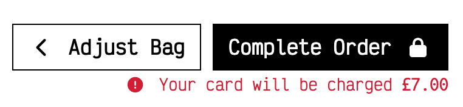

#  Granite Tap

Granite Tap is a B2C e-commerce store selling locally sourced beer from breweries from Aberdeen and Aberdeenshire, Scotland.

Granite Tap is your go-to online platform for discovering and enjoying an exquisite selection of locally brewed beers from the vibrant and thriving beer scene in Aberdeen and Aberdeenshire, Scotland. We take pride in connecting beer enthusiasts with the finest creations of local breweries, offering a unique taste of the region's craft beer culture.

The site is aimed at users who are looking to expand on their beer tastes. Rather than buying the same old, run of the mill beer from the supermarkets, users can experience a whole new world of beer and see what the North East of Scotland has to offer. 

Users can view different types beers from different breweries, get information on each product and make purchases through an esy to use, payment system.

The payment system uses Stripe. 

***As this site is for educational purposes, please do not use real debit/credit card details whilst using the site.***

Take a look though the live project - [Granite Tap](https://granite-tap-d7fc252cb5b2.herokuapp.com/)

---

CONTENTS

---

## Features

### Header

- The header is present on every page of the site giving users full navigation at all times.

#### Logo

- The logo for the site is a simple text logo generated within the html using the Victor Mono google font.
- The logo  links to the home page and is situated in the top left corner of the header.

#### Search Bar

- The search bar is displayed at the top of the page, always accessible to the user.
- The when a user inputs a pice of text, the results will return any product in which the product title or description holds.

#### About Icon

- The About icon links to the About Us page where the user can find information on Granite Tap, FAQs, newsletter sign up and a contact form.

#### My Account Icon

##### Unauthenticated Users

- The My Account icon, when clicked, will reveal a dropdown menu consisting of two options.
  - Register
  - Login

##### Authenticated Users

- If the user is authenticated, "My Account" text will be replaced by the users username they chose when registering for the site.
- This gives the user a visual indication that they are logged in to their account.
- When clicked, a dropdown menu is revealed to the user, consisting of links to My Profile, Wishlist and Logout.

#### Shopping Bag Icon

- The Shopping Bag icon links the users to the shopping bag page where users can view what products, if any are in there ready to be purchased.
- Beneath the Shopping Bag icon displays the total cost of their shopping bag and can be seen at all times so users can keep track of how much they are spending.

---

### Main Navigation

- The Main Navigation bar consists of three dropdown menus for the users to access the products list.

#### All Products

- The All Products dropdown menu displays four options for the user to filter the site products by:
    - By Price
    - By Rating
    - By Category
    - All Products

##### By Price

- The By Price option returns to the user the full product list in ascending order of price (lowest to highest).

##### By Rating

- The By Rating option will return to the user the full product list in descending order (highest to lowest).

##### By Category

- The By Category option will return to the user the full product list of beer type in alphabetical order.

##### All Products

- The All Products option will return to the user the full product list.

#### Beer Types

- The Beer Types dropdown menu displays four options for the user to filter the products by their beer type:
    - Lager
    - Ale
    - Stout
    - Sour

##### Lager

- The Lager option will return to the user all the different type of Lager in the product list.

##### Ale

- The Ale option will return to the user all the different type of Ale in the product list.

##### Stout

- The Stout option will return to the user all the different type of Stout in the product list.

##### Sour

- The Sour option will return to the user all the different type of Sour in the product list.

#### Breweries

- The Breweries dropdown menu displays four options for the user to filter the products by their brewery:
    - Brewdog
    - Brew Toon
    - Fierce
    - Six° North

##### Brewdog

- The Brewdog option will return to the user all the different beer produced by Brewdog in the product list.

##### Brew Toon

- The Brew Toon option will return to the user all the different beer produced by Brew Toon in the product list.

##### Fierce

- The Fierce option will return to the user all the different beer produced by Fierce in the product list.

##### Six° North

- The Six° North option will return to the user all the different beer produced by Six° North in the product list.

---
### Delivery Banner

- The delivery banner is located beneath the main navigation.
- The delivery banner indicates to users that if they spend more than £30 on their order, the delivery is free.

---

### Footer

- The footer is displayed on all pages of the site.
- The footer contains links to various features on the site.

#### Contact Us

- The Contact Us link will direct the user to the contact for on the About Page

#### Subscribe to our Newsletter

- The Subscibe to our Newsletter link will direct the user to the newsletter sign up on the about page

#### Visit us on Facebook

- The Visit us on Facebook link will direct the user to Facebook Login page on a new tab.
- As the Granite Tap site is for educational purposes, the Granite Tap Facebook buisness page has been deactivated.
- To view screenshots of the Granite Tap Facebook business page, please see the [Granite Tap Web Marketing](#Granite-Tap-Web-Marketing) section.

#### Privacy Policy

- The Privacy Policy link will direct users to the [Granite Tap Privacy Policy](https://www.termsfeed.com/live/6ce57fb3-3e55-4587-9ed0-703fd41df7f0) on a new tab.

---

### Home Page

- The background image of the home page is a of a hand holding a glass whilst pouring a beer from a bar tap.
- When entering the site, the user will be greeted with a simple message indicating that they are about to begin an exploration of the beer from the Northeast of Scotland.
- Beneath the welcome message, is a "Shop Now" button alllowing users to jump straight into exploring the products list.

---

### Products Page

- Users can access the products page from the main nav as documented above.

- When a users enters the product page, displayed will be the beer products they have filtered.

#### Product Count

- The product page displays a product count of how many products come under any specific filter. This giove the user an indication of ow many products of that type there are.

#### Product Page Filtering

- Much like the All Products dropdown menu in the Main Navigation, users can also use the "Sort by..." dropdown menu to filter the results as they see fit.

- Users can filter the products page using various options.

##### Filtering options

- Price (Low to High)
- Price (High to Low)
- Rating (Low to High)
- Rating (High to Low)
- Name (A-Z)
- Name (Z-A)
- Category (A-Z)
- Category (Z-A)

#### Product Page Details

- Users will be able to see various details around each product.

- Each product has specific information attached:
    - Product Image
        - The product image is a link to the product details page
    - Product Price
    - Product ABV percentage
    - The Brewery that manufactures the product.
        - This is a link to the brewery product list
    - The Beer Type
        - This is a link to the beer type product list
    - Product Rating

---

### Product Detail Page

- When a user clicks on a product form the product page they are directed to the Product Detail page.

#### Product Specific Details

- Within the product detail page, users can find product specific details:
    - Product Image
    - Product Name
    - Product Price
    - Brewery
    - Beer Type
    - Product Rating
    - Product Description
    - Volume of Conatiner
    - ABV percentage

#### Wishlist Button

- Users can add products to a wishlist and come back to purchasing them at a later date.

#### Quantity

- Users can adjust the quantity of the product they want to add to their shopping bag.
- This can be done by using either manually typing in the quantity or using the +/- buttons on either side of the input.

#### Adding Products to the Shopping Bag

- When users have decided they want to add the product to their shopping bag, they can clcik the "Add to Bag" button.

##### Add to Bag Success Message

- Once a product has been added to the shoppping bag, a success message is displayed.
- This message contains: 
    - A message confirming which product has been added.
    - The bag content which is scrollable.
    - The bag total.
    - A message informing the user how much more they need to spend if they want to take advantage of free delivery.
    - A button directing the user to the shopping bag.

#### Keeping Shopping Button

- Within the Products Detail page, there is also a "Keep Shopping" button. 
- If the user want to continue shopping, they acn click the "Keep shoppping" button and be redirected back to the products page.

#### You May Also Like...

- Beneath the product details section, a related products section has been implemented.
- This gives users the chance to view products of the same beer type and explore other breweries.
- The selection has has been randomised so everytime a user views a product, the related products will display random products of the same beer type.

---

### Shopping Bag

- Once users have completed viewing products and adding them to the bag, they can view their selections in full by clicking on the shopping bag icon or via the add to bag success message as documented above.

- In the shopping bag, users will have a view of the products they have added.
- Included information:
    - Product Info
        - Product Image
        - Product Name
        - Product SKU Code
    - Product Price
    - Quantity
    - Subtotal

#### Product Info

#### Product Price

#### Quantity

- When in the shopping bag, users have the oppotunity to adjust the quantity of the number of each product in the shopping bag.
- Once the user has changed the quantity in the Quantity input, the "Update" button will action this change.
- If the user wishes, they can also remove the product from the basket entirely by using the "Remove" button.

#### SubTotal

- The subtotal details the total of the specific line item.

#### Grand Total Details

- At the bottom of the shopping bag, information display to the user:
    - Bag Total
    - Delivery Cost
    - Grand Total
    - A message informing the user how much more they need to spend if they want to take advantage of free delivery.

##### Keep Shopping Button

- The keep shopping button will redirect the user back to the products page if they wish to continue to browse before checking out.

##### Secure Checkout

- The Secure Checkout button will direct the user to the Checkout page to complete their purchase.

----

### Checkout

- Completing a purchases can be made through the checkout page. 
- The checkout page consists of two main features:
    - User Details
    - Order Summary

#### User Details

- In this form, users will enter their own personal information:
    - Name
    - Email
    - Address
- Input fields marked with an asterisk are required and the user will not be able to complete their order without these fields being complete.

- Beneath the user details form is a checkbox to allow the user to opt to save their personal information

#### Order Summary

- The order summary displays:
    - Product count
    - Item information 
    - Sub Total
    - Order Total
    - Delivery Cost
    - Grand Total

#### Payment - Stripe

- The card payment is handled by Stripe.
- This ensures a secure payment.

- Invalid card details will automatically display an error message beneath the card details input.

- A warning message appear below the complete order button giving the user one final confimation before completing the order.
- Once payment details have been entered and the users completes the order, a loading screen overlay will appear indicating to the user that the payment is being processed.
- Once the payment is complete the Stripe webhook will search the database for the order and confirm that it exists.

***As this site is for eduactional purposes only, please do not enter real debit/credit card details***

***To find out more about stripe payment and how to test, please see [the Stripe documentation](https://stripe.com/docs?locale=en-GB).***

---

### Order Confirmation

- Upon completion of a successful checkout, the user is redirected to an order confirmation.
- Here, users will be able to review their order.
- Once orders are completed, it will be assigned an order number to alow users to distinguish one order from the other. 
- Users will also receive a confirmation email that is automaticaly generated using Django mail.

---

### My Profile

- Users who have signed up to the site will be ale view their own profiles via the my account dropdown in the site header as documented above.
- The My Profile page consists of two main features:
    - Default Delivery Infomation
    - Order History

#### Default Delivery Information

- Here, users can enter and update their own delivery information. Unlike in the checkout page, the form consists of only the users delivery details:
    - Phone Number
    - Street Address
    - Town/City
    - County
    - Postal Code
    - Country

- Users can edit this information at anytime and update using the "Update Information" button below the form.

#### Order History

- The order history section gives users a short overview of any previous orders made.
- Detailed in this overview is:
    - Order Number
        - Clickable link to the order summary.
    - Date the iorder was created.
    - Items in the order.

- When the user clicks the order number on the order history section of the profile page, they are redirected to the order confirmation. 
- There is also a alert messagwe displayed automatically informing the user that this is a past confirmation.
- Below the order confirmation is a "Back to Profile" button which will redirect the user bcak to the profile page.

### Wishlist

- Users also have access to their own wishlist via the link in the account dropdown.
- Users can add items to their wishlist via the product detail page as documented above.
- Within the wishlist page, users can view which items they have added.
- If the user wishes to purchase the wihslist item, like the products page, the image is a clickable link to the product detail and they can add the item to the shopping bag as normal.

- Much like the products page, the items within the wishlist have an overview of the product:
    - Name
    - Price
    - ABV
    - Brewery
    - Lager
    - Rating
- Below the product overview is a "Remove from Wishlist" button. This allows users to remove items from the wishlist if they no longer want or need it in there.

---

### About Page

- The About page has been implemented to host several features:
    - About Us
    - FAQs
    - Newsletter Sign Up
    - Contact Us

#### About Us

- The About Us section gives users more indepth information on what the site is about.
-  This section includes small paragraphs:
    - Who We Are?
    - Our Mission
    - Join Us on This Tasting Journey
    - Explore Local Flavours
    - Convenient Home Delivery

#### FAQs

- The FAQs section gives users a views of answers to common questions they may have.

- The FAQs section has been styled using a Bootstrap accordian dropdown, allowing users to reveal and collapse answers as they wish.

#### Sign Up to our Newsletter

- A newsletter sign up for has been implemented into the about page.
- This gives users an opportunity to sign up to the Granite Tap Newsletter so they can receive the latest news regarding Granite Tap and any special offers on.
- The Newsletter has been implemented using [Mailchimp](https://mailchimp.com/).

#### Contact Us

- A contact form has been included in the about page.
- Users can submit details such as:
    - Name
    - Email
    - Phone Number (optional)
    - Their message, question or query
- If users have any questions or issues, they can submit the contact form which is them posted and stored in the database.
- Contact queries can be veiwed by the site admin in the Django admin.

---

### Product Management

- Site Admin have extra access to certain features on the site. 
- One of which is Product Management. 
- Product management can be accessed by site admin users via the "My account" dropdown in the header.

#### Adding a Product

- Here, Site Admin users can add products to the site database and display in the products page.. 
- Site Admin can add all relevant product imformation:
    - Product category
    - SKU Code
    - Name
    - Brewery
    - ABV
    - Description
    - Volume
    - Price
    - Rating
    - Product Image
- Once alll reelvant information has been input, Site admin users can can add the new product using the "Add Product" button.

- Once the product is added to the site, the Site Admin user is redirected to the product detail page of the newly added product.

#### Editing/Deleting a Product

- Site Admin users can also edit and delete products.
- These buttons can be found in the product list below each product or in the product detail page of the product

##### Editing a product

- If a Site Admin user wishes to edit a product, they can do so by clicking on the "Edit" button.
- Once clicked, the Site Admin user will be redirected to the Product management page, "Edit a product".

- Much like the "Add a product" page, the form is the same except that the information is prepopulated with its information. 

- Here, Site Admin users can edit whatever pice of information they wish. 
- Once completed, The Site Admin user can click the "Edit Product" button and will be redirected back to the product detail page where the updated information is being displayed.

##### Deleting a Product

- If the Site Admin user wants to remove a product entirely from the site and database, they can click on the "Delete" button. 
- Once clicked, the item is removed from the site and the database.

---

## User Experience (UX)

This who visit the Granite Tap will most likely those interested in purchasing beer products from the Aberdeen/Aberdeenshire area.

### User Stories

#### EPIC | Viewing Products

- As a **SITE USER** I can **VIEW A LIST OF PRODUCTS** so that **I CAN SELECT WHICH ITEM I WANT TO TO BUY**
- As a **SITE USER** I can **VIEW INDIVIDUAL BEER PRODUCT DETAILS** so that **I IDENTIFY AND UNDERSTAND WHAT THE PRODUCT IS AND IF IT IS SUITABLE FOR ME**
- As a **SITE USER** I can **VIEW THE PRODUCT IMAGE** so that **I CAN DIFFERENTIATE BETWEEN PRODUCTS**

#### EPIC | Registration and User Accounts

- As a **SITE USER** I can **REGISTER FOR AN ACCOUNT** so that **I CAN HAVE A PERSONAL ACCOUNT AND VIEW MY PROFILE**
- As a **SITE USER** I can **LOGIN/LOGOUT OF MY ACCOUNT** so that **I CAN ACCESS MY PERSONAL INFORMATION**
- As a **SITE USER** I can **HAVE A PERSONAL USER PROFILE** so that **I CAN VIEW MY PERSONAL INFORMATION AND ORDER HISTORY**
- As a **SITE USER** I can **RECEIVE AN EMAIL CONFIRMING MY REGISTRY OF MY SITE ACCOUNT** so that **I CAN VERIFY MY ACCOUNT HAS BEEN CREATED**
- As a **SITE USER** I can **RECOVER MY PASSWORD INCASE I FORGET** so that **I CAN ACCESS MY ACCOUNT**

#### EPIC | Sorting and Filtering

- As a **SITE USER** I can **SORT THROUGH A LIST OF AVAILABLE PRODUCTS** so that **I CAN IDENTIFY THE BEST RATED, BEST PRICED PRODUCTS IN A SPECIFIC CATEGORY**
- As a **SITE USER** I can **SEARCH FOR A PRODUCT BY NAME** so that **I CAN FIND A SPECIFIC PRODUCT I WOULD LIKE TO VIEW/PURCHASE**
- As a **SITE USER** I can **SEE WHAT I HAVE SEARCHED FOR AND THE NUMBER OF RESULTS** so that **I QUICKLY DECIDE WHETHER THE PRODUCT IS AVAILABLE**
- As a **SITE USER** I can **SORT THE SPECIFIC CATEGORY OF PRODUCTS** so that **I CAN FIND THE BEST RATED OR BEST PRICED PRODUCT IN A SPECIFIC CATEGORY, OR SORT THE PRODUCTS IN THAT CATEGORY BY NAME**
- As a **SITE USER** I can **SORT MULTIPLE CATEGORIES OF PRODUCTS SIMOULTANIOUSLY** so that **I CAN FIND THE BEST RATED AND BEST PRICED PRODUCTS ACROSS A BROAD RANGE OF CATEGORIES**

#### EPIC | Purchasing and checkout
- As a **SITE USER** I can **VIEW THE ITEMS IN MY BASKET** so that **I CAN IDENTIFY WHAT ITEMS ARE IN THE BASKET, HOW MANY THEIR ARE AND WHAT THE TOTAL COST IS**
- As a **SITE USER** I can **ADJUST THE QUANTITY OF ITEMS IN THE BASKET** so that **I CAN MAKE CHANGES BEFORE PURCHASE IS COMPLETE**
- As a **SITE USER** I can **SELECT THE NUMBER OF PRODUCTS I WANT TO PURCHASE** so that **I DO NOT SELECT THE INCORRECT NUMBER OF ITEMS**
- As a **SITE USER** I can **VIEW HOW MUCH THE TOTAL COST OF MY PURCHASES WILL BE** so that **I CAN KEEP TRACK OF HOW MUCH I AM SPENDING**
- As a **SITE USER** I can **ENTER MY PAYMENT DETAILS EASILY AND QUICKLY** so that **I CAN COMPLETE MY PURCHASES WITH NO HASSLE**
- As a **SITE USER** I can **FEEL THAT MY PERSONAL AND PAYMENT DETAILS ARE BEING HANDLED WITH CARE** so that **I CAN CONFIDENTLY PROVIDE THE CORRECT INFORMATION NEEDED TO COMPLETE THE PURCHASE**
- As a **SITE USER** I can **VIEW AN ORDER CONFIRMATION AFTER CHECKOUT IS COMPLETE** so that **I CAN VERIFY I HAVENT MADE ANY ERRORS**

#### EPIC | About
- As a **SITE USER** I can **FIND INFORMATION ON THE COMPANY AND WHAT PRODUCTS THEY SELL** so that **I CAN DECIDE IF I WANT TO GIVE THEM MY BUSINESS**

#### EPIC | Delivery
- As a **SITE USER** I can **VIEW THE DELIVERY COST OF MY ORDERS** so that **I CAN KEEP TRACK OF HOW MUCH I AM SPENDING**
- As a **SITE USER** I can **VIEW FAQS REGARDING DELIVERY** so that **I CAN UNDERSTAND IF THE SITE WILL BE ABLE TO DELIVERY MY ORDER**

#### EPIC | Site Admin
- As a **SITE ADMIN** I can **ADD A PRODUCT TO THE SITE** so that **I CAN UPDATE THE SITE WITH NEW AND DIFFERENT PRODUCTS**
- As a **SITE ADMIN** I can **EDIT AND UPDATE PRODUCTS** so that **CHANGE PRICES, DESCRIPTIONS, IMAGES AND OTHER PRODUCT DETAILS**
- As a **SITE ADMIN** I can **DELETE PRODUCTS FROM THE STORE SITE** so that **I CAN REMOVE ITEMS THAT ARE NO LONGER REQUIRED**
- As a **SITE ADMIN** I can **HAVE A FACEBOOK BUSINESS PAGE** so that **I CAN EXTEND MY POTENTIAL BUSINESS FURTHER**
- As a **SITE USER** I can **SIGN UP TO A NEWSLETTER** so that **I CAN KEEP UP TO DAYTE WITH THE LATEST PRODUCTS AND INFORMATION FROM THE SITE**

### Design

#### Colour Scheme

- The site uses a sinmple colour scheme of monochromatic colours throught.
- Outside of the monochronme colours are bootstrap message colours
    - Red = Danger
    - Yellow = Warning
    - Blue  = Info
    - Green = Success

#### Images

- There is one main image on the site of the home page. Again using mainly monochromtaic colours with a hint of amber/orange.
- The remaining images are all product images. 

#### Font

- The font used throughout the site is Victor Mono. This was imported from Google fonts. Sans-serif has been used as a back up font incase of any import issues.

